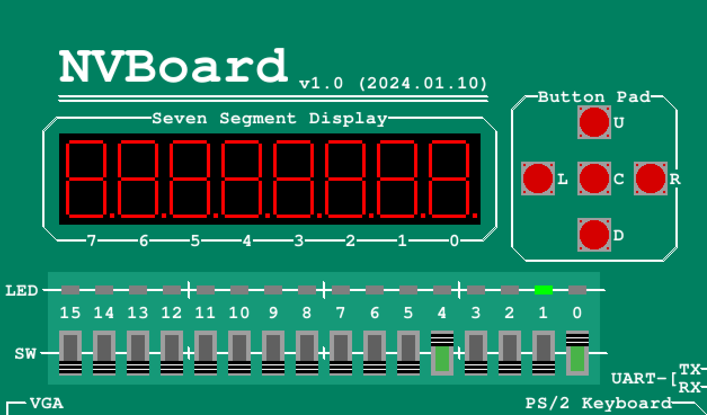

# Lab 02 - Hierarchical Adder and FPGA Mapping

Lab 02 develops a one-bit full adder, composes four instances into a four-bit ripple-carry adder, and runs the design on NVBoard using switches and LEDs.

## Objectives

- Implement a one-bit full adder from primitive logic gates.
- Reuse the full-adder module to construct a four-bit adder.
- Map two four-bit operands to eight switches and the five-bit result to LEDs.
- Demonstrate the completed design on NVBoard.

## 1. One-bit full adder

The `oneadder` module adds `a`, `b`, and `carryin`:

```text
result   = a XOR b XOR carryin
carryout = (a AND b) OR (carryin AND (a XOR b))
```

Together, `{carryout, result}` represents the complete two-bit result for all eight possible input combinations.

## 2. Four-bit ripple-carry adder

`FourBitAdder` connects four `oneadder` instances from the least-significant bit to the most-significant bit. Each stage passes its carry to the next stage, and the final carry becomes `s[4]`.

```text
A[0], B[0], 0  -> [FA0] -> S[0], carry[0]
A[1], B[1], carry[0] -> [FA1] -> S[1], carry[1]
A[2], B[2], carry[1] -> [FA2] -> S[2], carry[2]
A[3], B[3], carry[2] -> [FA3] -> S[3], S[4]
```

The output range is `0` to `30`, so five result bits are required.

## 3. FPGA and NVBoard mapping

The `FourBitAdder` inputs and output are mapped to the board interface as follows:

| Board signal | Function |
| --- | --- |
| `SW[3:0]` | `a[3:0]`, with `SW0` as the least-significant bit |
| `SW[7:4]` | `b[3:0]`, with `SW4` as the least-significant bit |
| `LED[3:0]` | `s[3:0]`, the four sum bits |
| `LED[4]` | `s[4]`, the final carry-out |

The simulator or board constraints connect these switches and LEDs directly to the `FourBitAdder` ports.

### NVBoard demonstration



In the captured run, `SW0 = 1` and `SW4 = 1`, so both operands are `0001`. The output is `00010`: `LED1` is illuminated, confirming `1 + 1 = 2`.

## Files

| File | Purpose |
| --- | --- |
| `onebitadder.v` | Gate-level one-bit full adder |
| `fourbitadder.v` | Four-stage ripple-carry adder |
| `assets/nvboard-4bit-adder-demo.png` | NVBoard implementation evidence |

## Reference

- [DDCA Spring 2025 Lab 2 manual](https://safari.ethz.ch/ddca/spring2025/lib/exe/fetch.php?media=ddca_ss25_lab2_manual.pdf)
