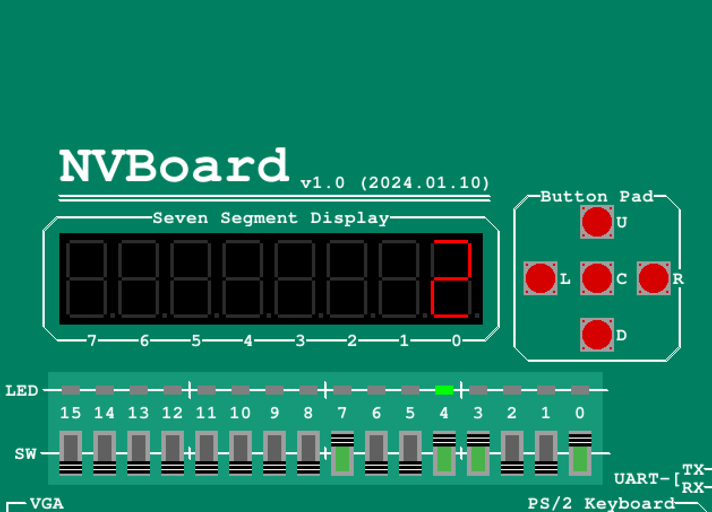
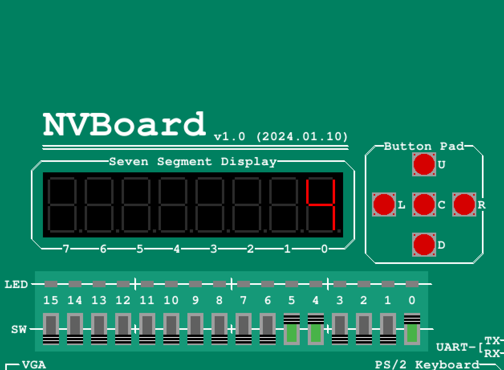

# Lab 03 - Adder with Seven-Segment Display

Lab 03 extends the four-bit adder with a hexadecimal seven-segment decoder. Two switch-selected operands are added, the low four result bits appear on the rightmost display, and a separate LED shows the carry-out.

## Design

The design contains four Verilog modules:

| File / module | Role |
| --- | --- |
| [FullAdder.v](FullAdder.v) / `FullAdder` | Adds `a`, `b`, and `ci` using XOR, AND, and OR gates; outputs sum `s` and carry `co`. |
| [FourBitAdder.v](FourBitAdder.v) / `FourBitAdder` | Chains four full adders with initial carry-in 0; outputs the five-bit unsigned sum `c[4:0]`. |
| [Decoder.v](Decoder.v) / `Decoder` | Converts a four-bit value to a hexadecimal seven-segment pattern. |
| [top.v](top.v) / `top` | Connects the adder to the decoder and routes the fifth sum bit to `LED`. |

For the internal five-bit sum `s` in `top`:

```text
s = A + B
displayed hex digit = s[3:0]
LED = s[4]
```

The decoder uses active-low outputs: `D[6:0] = {g, f, e, d, c, b, a}`, where 0 lights a segment. It covers hexadecimal `0` through `F`, using the usual `A`, `b`, `C`, `d`, `E`, and `F` glyphs. Its default pattern turns all seven segments off.

## NVBoard I/O mapping

| NVBoard control | RTL port / meaning |
| --- | --- |
| `SW[3:0]` | `A[3:0]`; `SW0` has weight 1. |
| `SW[7:4]` | `B[3:0]`; `SW4` has weight 1. |
| Rightmost seven-segment display (digit 0) | `D[6:0]`, displaying the low four sum bits as hex. |
| `LED4` | `LED`, the fifth sum bit (weight 16). |

The result ranges from 0 to 30. Read it as **16 times the carry LED value plus the displayed hexadecimal digit**. For example, LED4 on and digit `2` means `0x12`, or 18 in decimal.

## Running results

### 9 + 9 = 18: carry-out asserted



`SW[3:0] = 1001` and `SW[7:4] = 1001`, so `A = 9` and `B = 9`. Their sum is `10010` in binary. The display shows `2` and LED4 is on, representing `16 + 2 = 18`.

### 1 + 3 = 4: no carry-out



`SW[3:0] = 0001` and `SW[7:4] = 0011`, so `A = 1` and `B = 3`. The sum is `00100` in binary. The display shows `4` and LED4 is off.

These screenshots document the supplied NVBoard runs, including examples with and without carry-out.

## Project use

Use `top` as the top-level module and include the four `.v` files in this directory. Build each lab separately: Lab 02 also defines a module named `FourBitAdder`, with a different output port name.

The repository includes the RTL and run screenshots. NVBoard build files, pin bindings, and physical FPGA constraints are not included; the table above describes the connections used in the demonstrated setup.
