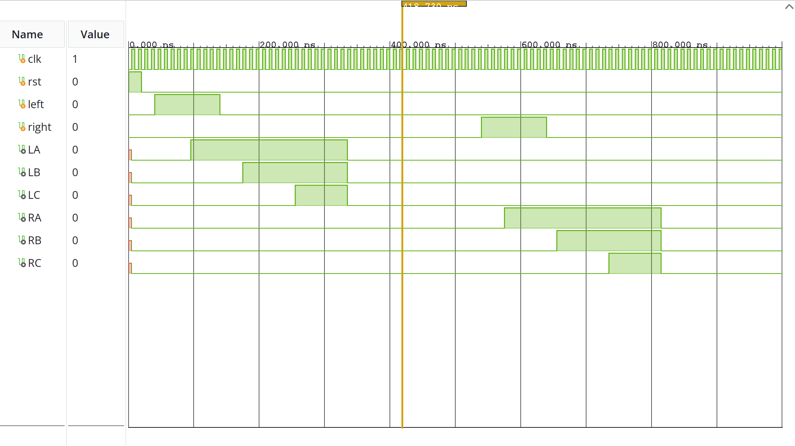
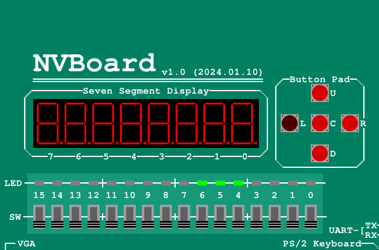
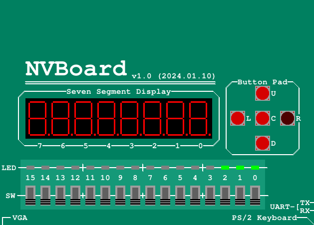

# Lab 04 - Sequential Turn-Signal FSM

Lab 04 implements a finite-state machine that reproduces the progressive left and right rear turn signals of a car. A request starts a three-step animation on the selected side, and the controller then returns to the idle state.

## Design

The lab contains three Verilog files:

| File / module | Role |
| --- | --- |
| [fsm.v](fsm.v) / `fsm` | Implements the state register, next-state logic, and six turn-signal outputs. |
| [clk_div.v](clk_div.v) / `clk_div` | Generates a periodic clock-enable pulse from a three-bit counter. |
| [fsm_tb.v](fsm_tb.v) / `fsm_tb` | Applies reset, left-turn, and right-turn requests for behavioral simulation. |

The controller uses one idle state and three states for each direction:

```text
OFF --left-->  L1 --> L2 --> L3 --> OFF
OFF --right--> R1 --> R2 --> R3 --> OFF
```

| State | Active lamps |
| --- | --- |
| `OFF` | None |
| `L1` | `LA` |
| `L2` | `LA`, `LB` |
| `L3` | `LA`, `LB`, `LC` |
| `R1` | `RA` |
| `R2` | `RA`, `RB` |
| `R3` | `RA`, `RB`, `RC` |

The output logic is Moore-style: the lamps depend only on the current state. If both direction inputs are asserted while the FSM is in `OFF`, the `left` branch has priority. Once a sequence begins, it completes all three steps before the FSM returns to `OFF`.

## Clock enable

`fsm` remains clocked by the original `clk`. The three-bit counter in `clk_div` asserts `clk_en` when all counter bits are 1, so the FSM advances once every eight input-clock cycles. In the supplied testbench, `clk` has a 10 ns period (100 MHz), making each state advance occur every 80 ns.

## Vivado simulation



The waveform first asserts `left` and shows `LA`, then `LA + LB`, then `LA + LB + LC`. It later asserts `right` and produces the matching `RA`, `RA + RB`, and `RA + RB + RC` sequence. The opposite side remains off throughout each animation.

## NVBoard results

### Left turn



Pressing the left control runs the left sequence. The captured final stage has NVBoard LEDs 6, 5, and 4 illuminated.

### Right turn



Pressing the right control runs the mirrored sequence. The captured final stage has NVBoard LEDs 2, 1, and 0 illuminated.

## Project use

Add all three `.v` files to a Vivado project. Select `fsm` as the synthesis/implementation top module and `fsm_tb` as the simulation top module. The repository contains the RTL, testbench, and verification screenshots; board constraints and NVBoard build files are not included.
